# 🌍 Languages

- 🇬🇧 English (default)
- 🇷🇺 [Русский](README.ru.md)
- 🇺🇦 [Українська](README.uk.md)

# 🏢 Enterprise Active Directory Lab

> A small enterprise-style Microsoft Active Directory laboratory environment built with Windows Server 2025 and Windows 11 clients in Oracle VirtualBox.


---

## 📖 Overview

This repository documents the deployment of a Windows Server 2025 enterprise laboratory environment designed to simulate a small corporate network.

The primary objective of the project was to gain practical experience with enterprise Windows infrastructure by deploying and configuring a centralized Active Directory environment from scratch.

The lab includes a fully functional domain controller, automatic network configuration through DHCP, internal DNS name resolution, centralized authentication using Active Directory, Group Policy management, file sharing with NTFS permissions, and Windows 11 domain clients.

Although this is a laboratory environment, the configuration follows many practices commonly used in small and medium-sized enterprise networks.

---

### 🏗️ Infrastructure Overview

| Server | Services |
|----------|-------------------------------------------------|
| DC01     | AD DS • DNS • DHCP • File Server • Group Policy |
| CLIENT01 | Domain Workstation                              |
| CLIENT02 | Domain Workstation                              |

---

## 📚 Table of Contents

* [🎯 Project Objectives](#-project-objectives)
* [🖥️ Lab Environment](#️-lab-environment)
* [🌐 Network Topology](#-network-topology)
* [📡 Network Configuration](#-network-configuration)
* [⚙️ Technologies](#️-technologies)
* [✨ Key Features](#-key-features)
* [📁 Repository Structure](#-repository-structure)
* [📌 Documentation](#-documentation)
* [🏛️ Infrastructure Design](#️-infrastructure-design)
* [🚀 Deployment Workflow](#-deployment-workflow)
* [🖧 Network Architecture](#-network-architecture)
* [🏢 Active Directory Structure](#-active-directory-structure)
* [👥 User and Group Management](#-user-and-group-management)
* [🔑 Authentication](#-authentication)
* [🔐 Security Configuration](#-security-configuration)
* [🚀 Project Highlights](#-project-highlights)
* [💼 Skills Demonstrated](#-skills-demonstrated)
* [🚀 Future Improvements](#-future-improvements)
* [📸 Screenshots](#-screenshots)
* [👤 Author](#-author)
* [📄 License](#-license)

---

## 🎯 Project Objectives

The following objectives were successfully completed during the implementation of the lab:

* Deploy Windows Server 2025 as a Domain Controller
* Configure Active Directory Domain Services (AD DS)
* Deploy an integrated DNS Server
* Configure a DHCP Server with automatic address assignment
* Join Windows 11 clients to the domain
* Create Organizational Units (OUs)
* Create users and security groups
* Configure shared folders
* Apply NTFS permissions
* Configure Group Policy Objects (GPO)
* Map network drives automatically
* Validate communication between all virtual machines

---

## 🖥️ Lab Environment

| Component               | Value               |
| ----------------------- | ------------------- |
| Hypervisor              | Oracle VirtualBox   |
| Server Operating System | Windows Server 2025 |
| Client Operating System | Windows 11 Pro      |
| Domain Name             | KUZNIETSOV.local    |
| Domain Controller       | DC01                |
| Virtual Network         | Internal Network    |
| Number of Servers       | 1                   |
| Number of Clients       | 2                   |

---

### Virtual Machine Specifications

| Hostname | CPU | RAM | Storage |
|---|---|---|---|
| DC01 | 2 vCPU | 4 GB | 60 GB |
| CLIENT01 | 2 vCPU | 4 GB | 50 GB |
| CLIENT02 | 2 vCPU | 4 GB | 50 GB |

---

## 🌐 Network Topology

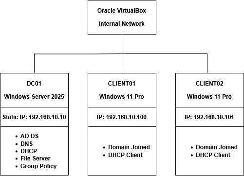

The topology illustrates the relationship between the Domain Controller and the Windows 11 clients within the isolated VirtualBox internal network.

---

## 📡 Network Configuration

| Device            | Address                         |
| ----------------- | ------------------------------- |
| Domain Controller | 192.168.10.10                   |
| DNS Server        | 192.168.10.10                   |
| DHCP Server       | 192.168.10.10                   |
| Gateway           | Not configured                  |
| DHCP Scope        | 192.168.10.100 – 192.168.10.200 |

---

## ⚙️ Technologies

| Technology                       | Purpose                          |
| -------------------------------- | -------------------------------- |
| Windows Server 2025              | Domain Services                  |
| Windows 11 Pro                   | Client Operating System          |
| Active Directory Domain Services | Centralized Authentication       |
| DNS                              | Name Resolution                  |
| DHCP                             | Automatic IP Configuration       |
| File Server                      | Centralized Storage              |
| NTFS Permissions                 | Access Control                   |
| Group Policy                     | Centralized Administration       |
| PowerShell                       | Administration & Troubleshooting |
| Oracle VirtualBox                | Virtualization Platform          |

---

## ✨ Key Features

### Active Directory Infrastructure

* Centralized Active Directory Domain Services (AD DS)
* Organizational Units (OUs) for users, groups, computers, and servers
* Domain user and security group management
* Windows 11 domain integration
* Centralized authentication

---

### Network Services

* Active Directory-integrated DNS Server
* DHCP Server with automatic IPv4 address assignment
* Automatic DNS registration
* Internal name resolution
* Centralized network configuration

---

### File Services

* SMB File Server
* Shared folder (`\\DC01\Public`)
* NTFS permissions
* Share permissions
* Automatic network drive mapping

---

### Group Policy Objects (GPO)

* Corporate desktop wallpaper deployment
* Hide local C: drive
* Automatic network drive mapping
* Disable Command Prompt
* Disable Control Panel
* Disable Registry Editor
* Disable USB removable storage
* Windows Audit Policy
* Logon Script deployment

---

### Administration & Validation

* Group Policy Management Console (GPMC)
* PowerShell administration
* Event Viewer monitoring
* GPResult verification
* Ping and NSLookup testing
* DHCP lease verification
* Domain authentication testing

---

## 📁 Repository Structure

```text
windows-server-enterprise-lab/
│
├── README.md
├── README.ru.md
├── README.uk.md
├── LICENSE
├── .gitignore
│
├── docs/
│   ├── en/
│   │   ├── 01-network-topology.md
│   │   ├── 02-active-directory.md
│   │   ├── 03-dns.md
│   │   ├── 04-dhcp.md
│   │   ├── 05-file-server.md
│   │   ├── 06-group-policy.md
│   │   └── 07-testing.md
│   ├── ru/
│   │   ├── 01-network-topology.md
│   │   ├── 02-active-directory.md
│   │   ├── 03-dns.md
│   │   ├── 04-dhcp.md
│   │   ├── 05-file-server.md
│   │   ├── 06-group-policy.md
│   │   └── 07-testing.md
│   ├── uk/
│       ├── 01-network-topology.md
│       ├── 02-active-directory.md
│       ├── 03-dns.md
│       ├── 04-dhcp.md
│       ├── 05-file-server.md
│       ├── 06-group-policy.md
│       └── 07-testing.md
│
├── images/
│   ├── active-directory/
│   │   ├── active-directory.png
│   │   ├── security-groups.png
│   │   └── users.png
│   ├── client/
│   │   ├── domain-joined.png
│   │   └── mapped-drive.png
│   ├── dhcp/
│   │   ├── dhcp-leases.png
│   │   └── dhcp-manager.png
│   ├── dns/
│   │   └── dns-manager.png
│   ├── file-server/
│   │   ├── file-server.png
│   │   ├── ntfs-permissions.png
│   │   └── share-permissions.png
│   ├── group-policy/
│   │   └── gpo.png
│   ├── infrastructure/
│   │   ├── server-manager.png
│   │   ├── topology.png
│   │   └── virtualbox.png
│   └── testing/
│       ├── event-viewer.png
│       ├── gpresult.png
│       ├── ipconfig.png
│       ├── nslookup.png
│       └── ping.png
│
└── scripts/
    └── login.bat   # Logon script for drive mapping
```

---

## 📌 Documentation

Detailed configuration guides are available in the `docs` directory.

| Document               | Description                         |
| ---------------------- | ----------------------------------- |
| 01-network-topology.md | Network design and IP addressing    |
| 02-active-directory.md | Active Directory deployment         |
| 03-dns.md              | DNS configuration                   |
| 04-dhcp.md             | DHCP configuration                  |
| 05-file-server.md      | Shared folders and NTFS permissions |
| 06-group-policy.md     | Group Policy configuration          |
| 07-testing.md          | Validation and testing procedures   |

---

> Continue reading to learn how each infrastructure service was configured and validated.

## 🏛️ Infrastructure Design

The laboratory environment simulates a centralized Windows Server infrastructure commonly found in small and medium-sized enterprises (SMEs). The deployment focuses on identity management, network services, centralized administration, and secure file sharing.

A single Windows Server 2025 virtual machine acts as the core infrastructure server and hosts multiple critical services. Two Windows 11 Pro virtual machines are joined to the Active Directory domain and function as managed client workstations.

The entire environment is isolated within an Oracle VirtualBox internal network, allowing enterprise technologies to be tested without requiring physical hardware or impacting the host operating system.

---

### Infrastructure Components

| Hostname | Operating System    | Role                                      |
| -------- | ------------------- | ----------------------------------------- |
| DC01     | Windows Server 2025 | Domain Controller, DNS, DHCP, File Server |
| CLIENT01 | Windows 11 Pro      | Domain Workstation                        |
| CLIENT02 | Windows 11 Pro      | Domain Workstation                        |

---

## 🚀 Deployment Workflow

The environment was deployed using the following sequence:

1. Installed Windows Server 2025
2. Configured static IP addressing
3. Installed Active Directory Domain Services (AD DS)
4. Promoted the server to a Domain Controller
5. Configured DNS services
6. Installed and configured DHCP Server
7. Created Active Directory Organizational Units
8. Created users and security groups
9. Joined Windows 11 clients to the domain
10. Configured Group Policy Objects (GPOs)
11. Configured file sharing and NTFS permissions
12. Tested authentication, DNS, DHCP, and permissions

---

## 🖧 Network Architecture

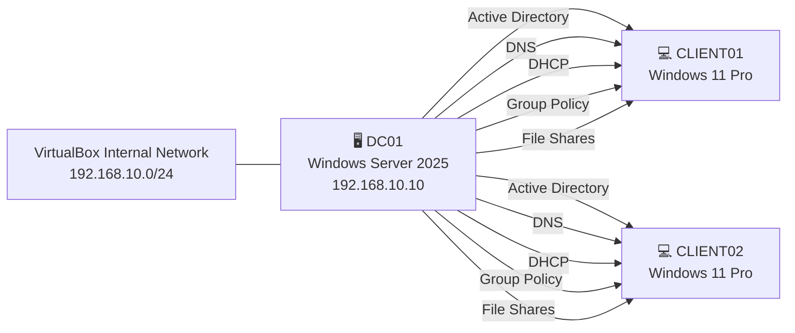

The Domain Controller provides all core infrastructure services for the laboratory environment. Windows 11 clients automatically receive network configuration from the DHCP server, resolve names through the DNS service, authenticate against Active Directory, receive Group Policy Objects (GPOs), and access centralized file shares.


---

### IP Addressing

| Device            | Address                         |
| ----------------- | ------------------------------- |
| Domain Controller | 192.168.10.10                   |
| DNS Server        | 192.168.10.10                   |
| DHCP Server       | 192.168.10.10                   |
| Default Gateway   | Not configured                  |
| DHCP Scope        | 192.168.10.100 - 192.168.10.200 |

Clients automatically receive:

* IP Address
* Subnet Mask
* Preferred DNS Server
* Lease Time

using the DHCP service running on the Domain Controller.

---

## 🏢 Active Directory Structure

The Active Directory environment was organized using Organizational Units (OUs) to simplify administration and Group Policy deployment.

```text
Domain
│
└── Company
    │
    ├── Users
    │     ├── IT
    │     ├── HR
    │     └── Finance
    │
    ├── Groups
    │
    ├── Computers
    │
    └── Servers
```

This structure follows common enterprise administration practices by separating users, computers, and administrative objects into dedicated Organizational Units.

---

## 👥 User and Group Management

User accounts were created inside their respective Organizational Units and assigned to security groups according to their department.

Security groups are used to manage permissions instead of assigning permissions directly to users. This approach simplifies administration and follows Microsoft's recommended access control model.

Example departmental groups include:

| Group   | Purpose            |
| ------- | ------------------ |
| IT      | IT Department      |
| HR      | Human Resources    |
| Finance | Finance Department |

---

## 🔑 Authentication

Both Windows 11 clients were successfully joined to the Active Directory domain.

Domain authentication provides centralized identity management, allowing users to authenticate against the Domain Controller instead of maintaining separate local accounts on each workstation.

Benefits include:

* Centralized account management
* Single sign-on (SSO)
* Centralized password policies
* Group Policy enforcement
* Simplified administration

---

## 🔐 Security Configuration

Security configurations implemented:

* Password Policies
* Account Lockout Policies
* Least Privilege
* NTFS Access Control
* Share Permissions

---

## 🚀 Project Highlights

This project demonstrates the deployment of a fully functional Microsoft enterprise infrastructure using Windows Server 2025 and Windows 11 clients.

Implemented features include:

* ✅ Deployed Windows Server 2025 as a Domain Controller
* ✅ Configured Active Directory Domain Services (AD DS)
* ✅ Implemented an Active Directory-integrated DNS Server
* ✅ Configured DHCP with automatic IPv4 address assignment
* ✅ Joined Windows 11 clients to the Active Directory domain
* ✅ Designed Organizational Units (OUs) for logical administration
* ✅ Created domain users and security groups
* ✅ Configured NTFS and Share Permissions
* ✅ Deployed a centralized File Server
* ✅ Configured Group Policy Objects (GPOs)
* ✅ Implemented automatic drive mapping
* ✅ Validated DNS, DHCP, authentication, and file sharing
* ✅ Verified Group Policy processing using `gpresult`
* ✅ Tested connectivity using `ping`, `nslookup`, and `ipconfig`

---

## 💼 Skills Demonstrated

This project demonstrates hands-on experience with Microsoft enterprise infrastructure technologies.

### Windows Server Administration

* Windows Server 2025
* Server Manager
* Feature and Role Installation
* Windows Server Management

### Active Directory

* Active Directory Domain Services (AD DS)
* Organizational Units (OUs)
* Domain Users
* Security Groups
* Domain Join
* Authentication

### Networking

* DNS Server Configuration
* DHCP Server Configuration
* IPv4 Address Management
* Name Resolution
* Network Connectivity Testing

### Group Policy

* Group Policy Management Console (GPMC)
* Organizational Unit-based Policy Assignment
* Drive Mapping
* Login Scripts
* Security Policies

### File Services

* Shared Folders
* NTFS Permissions
* Share Permissions
* Access Control
* Centralized Storage

### Client Administration

* Windows 11 Domain Clients
* Domain Authentication
* Group Policy Processing
* Drive Mapping Validation

### Tools & Technologies

* Oracle VirtualBox
* PowerShell
* Command Prompt
* Event Viewer
* Windows Administrative Tools

---

## 🚀 Future Improvements

Planned enhancements include:

- Windows Admin Center
- Windows Server Backup
- WSUS Deployment
- DFS Namespace
- DFS Replication
- Active Directory Certificate Services (AD CS)
- PowerShell Automation

---

## 📸 Screenshots

The following screenshots demonstrate the successful deployment and validation of the Enterprise Active Directory Lab.

### Active Directory

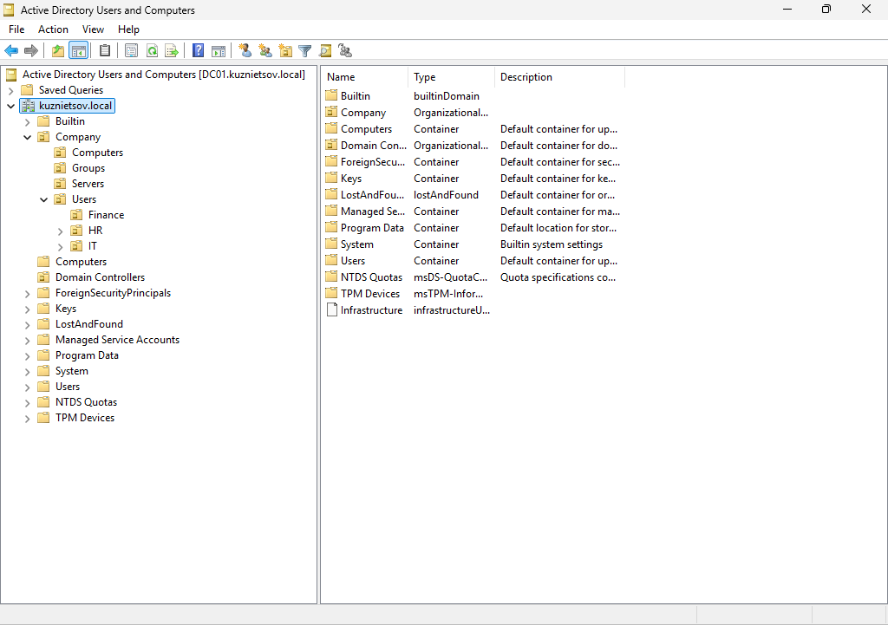

The Active Directory Users and Computers console showing the domain structure, Organizational Units (OUs), and managed objects used throughout the lab.

---

### DNS Server

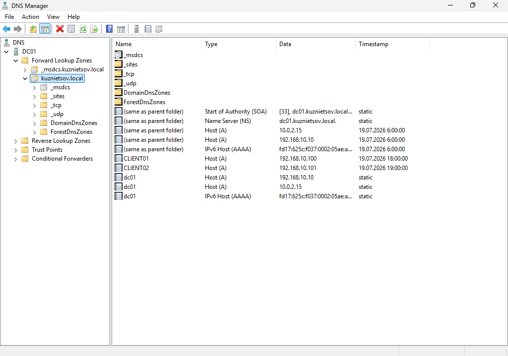

The DNS Manager console with the Active Directory-integrated forward lookup zone used for internal name resolution.

---

### DHCP Server

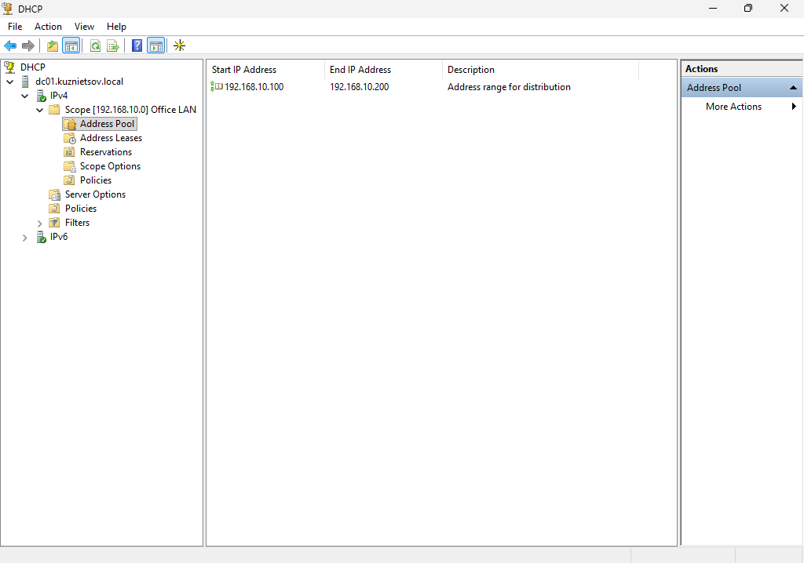

The DHCP Manager displaying the configured IPv4 scope used to automatically assign network settings to domain clients.

---

### Organizational Units

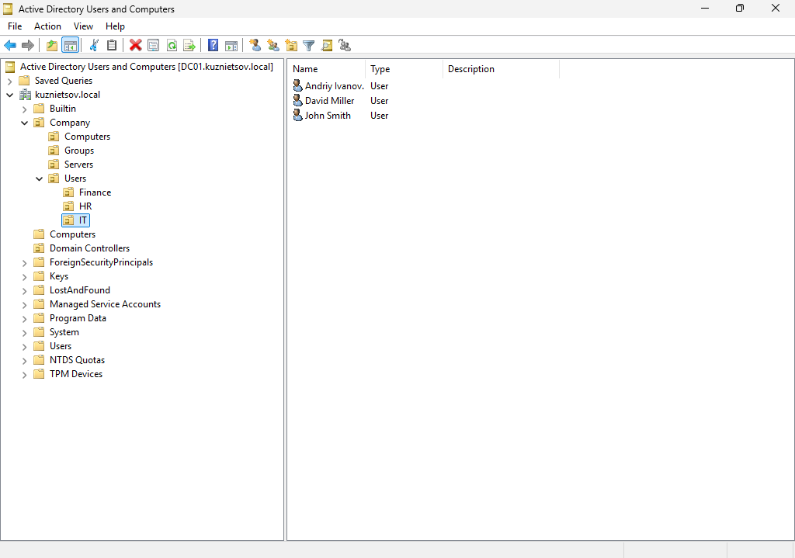

Organizational Units created to logically separate users, computers, and administrative objects for simplified management and Group Policy deployment.

---

### Group Policy Management

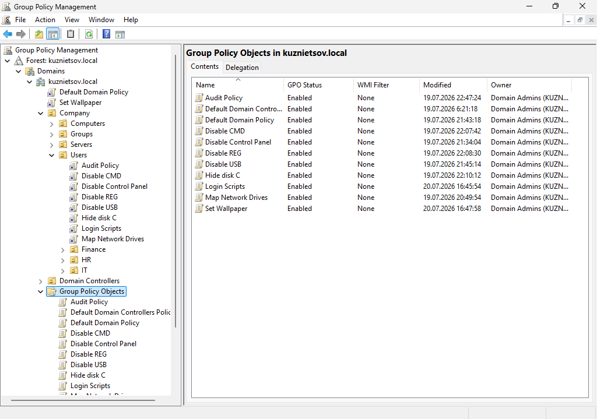

Group Policy Objects (GPOs) configured to enforce centralized security settings, desktop configuration, and drive mapping.

---

### Shared Folder Configuration

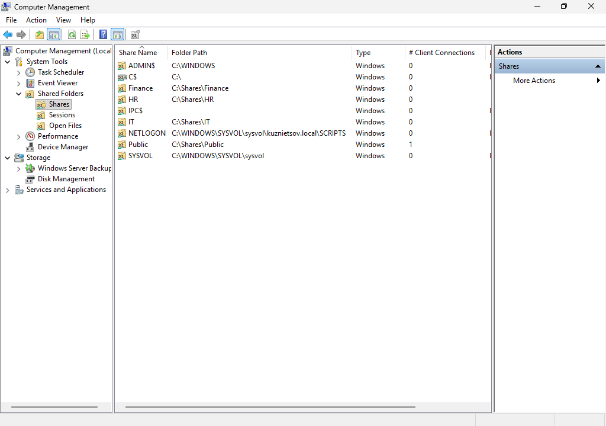

The shared folder configuration on the file server providing centralized storage for authenticated domain users.

---

### NTFS Permissions

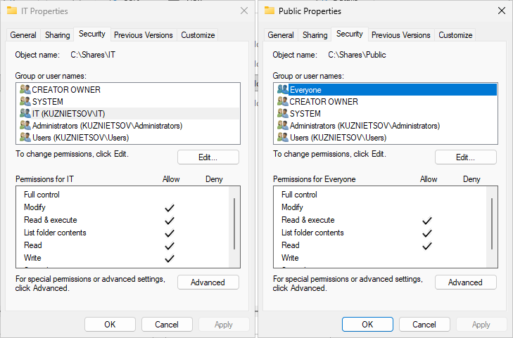

NTFS permissions configured to provide role-based access control using Active Directory security groups.

---

### Share Permissions

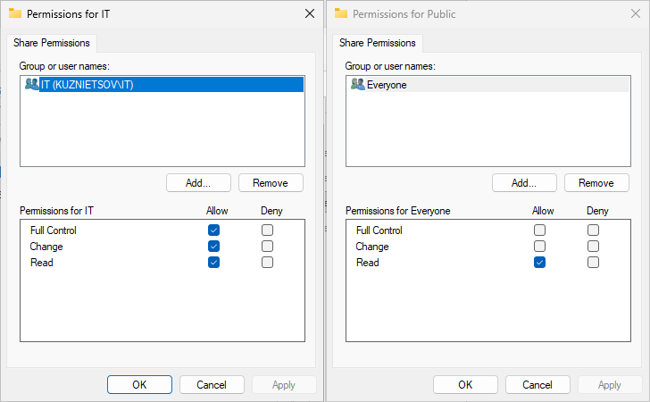

SMB share permissions configured to control network access to shared resources.

---

### Mapped Network Drive

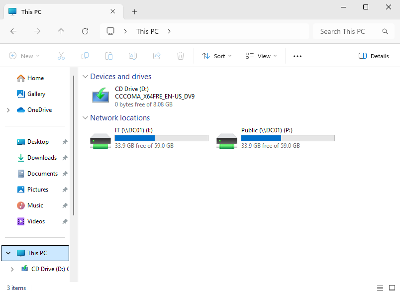

A mapped network drive automatically deployed to domain users through Group Policy.

---

### Domain Join

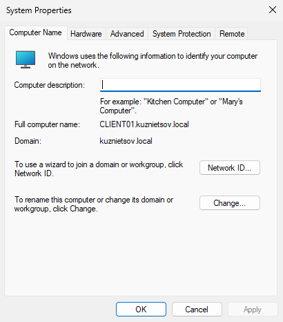

A Windows 11 client successfully joined to the Active Directory domain and managed by the Domain Controller.

---

### Network Configuration

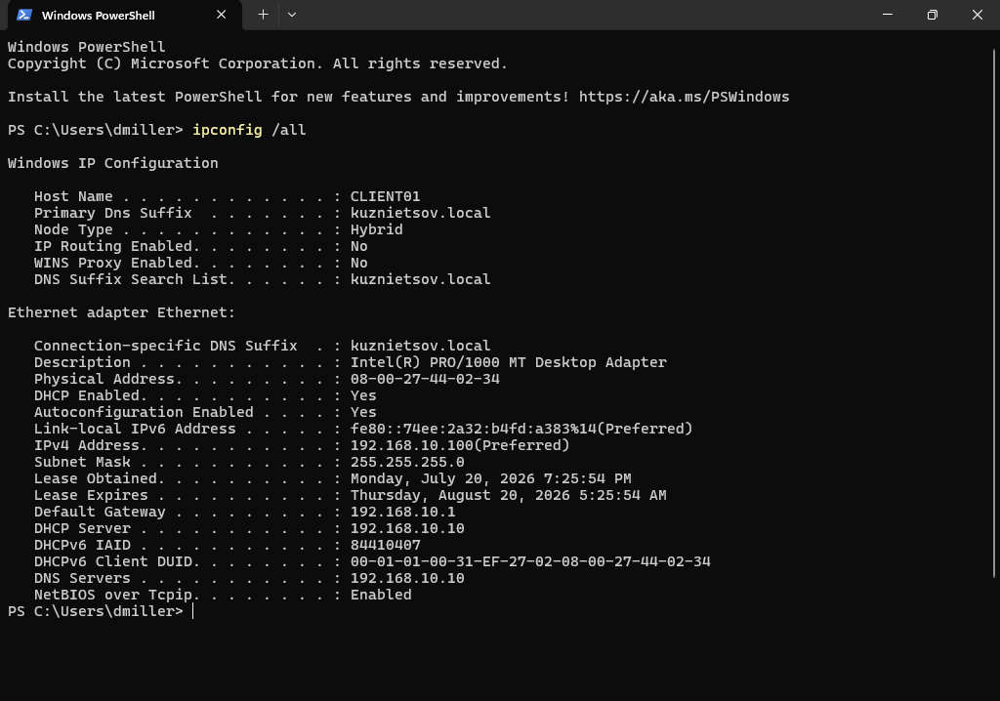

The client received its IP configuration automatically from the DHCP server, including the DNS server address.

---

### DNS Resolution

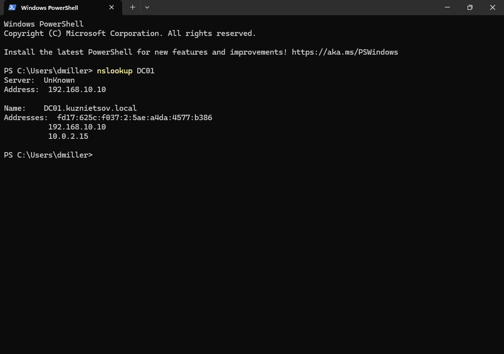

DNS name resolution verified using `nslookup`, confirming successful communication with the internal DNS server.

---

### Group Policy Result

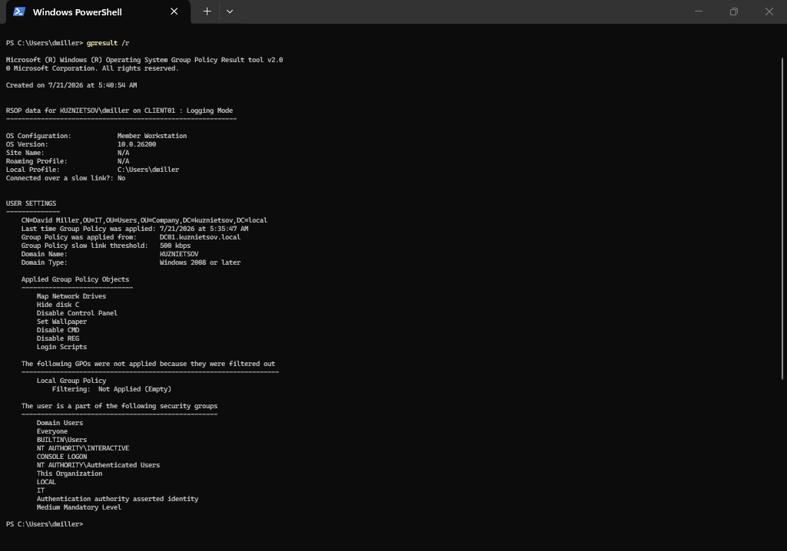

The `gpresult` command confirming that the expected Group Policy Objects were successfully applied to the client.

---

### Event Viewer

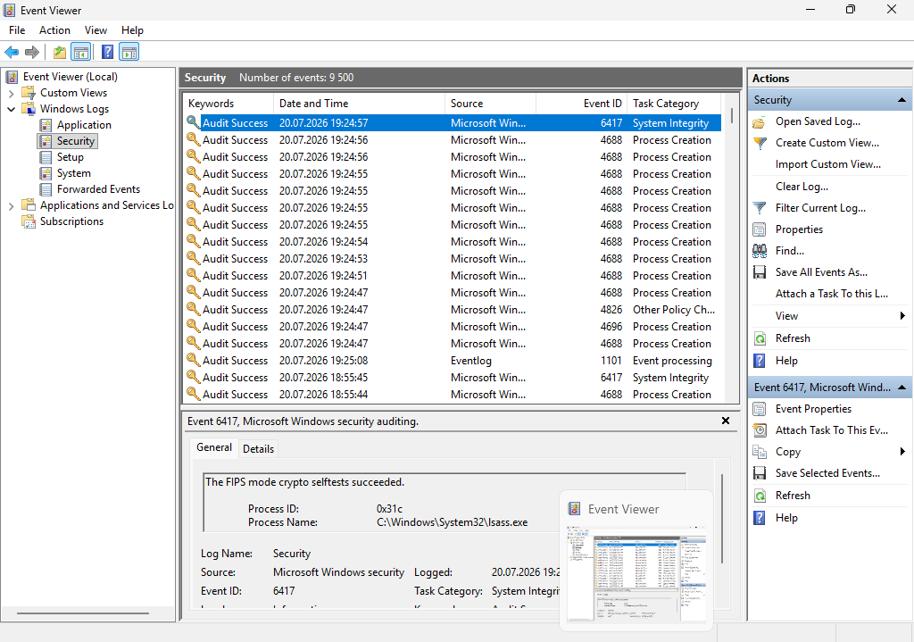

Windows Event Viewer used to verify successful authentication events and monitor system operation during testing.

---

These screenshots provide visual validation of the deployed Active Directory infrastructure, demonstrating successful configuration of DNS, DHCP, Group Policy, file services, and Windows 11 domain clients.

---

## 👤 Author

Windows System Administration Portfolio Project

Created to demonstrate practical experience with:

- Active Directory
- Windows Server Administration
- DNS
- DHCP
- Group Policy
- Enterprise Networking

**Technologies:** Windows Server 2025 • Active Directory • DNS • DHCP • Group Policy • Oracle VirtualBox

---

## 📄 License

This project is licensed under the MIT License. See the LICENSE file for details.
