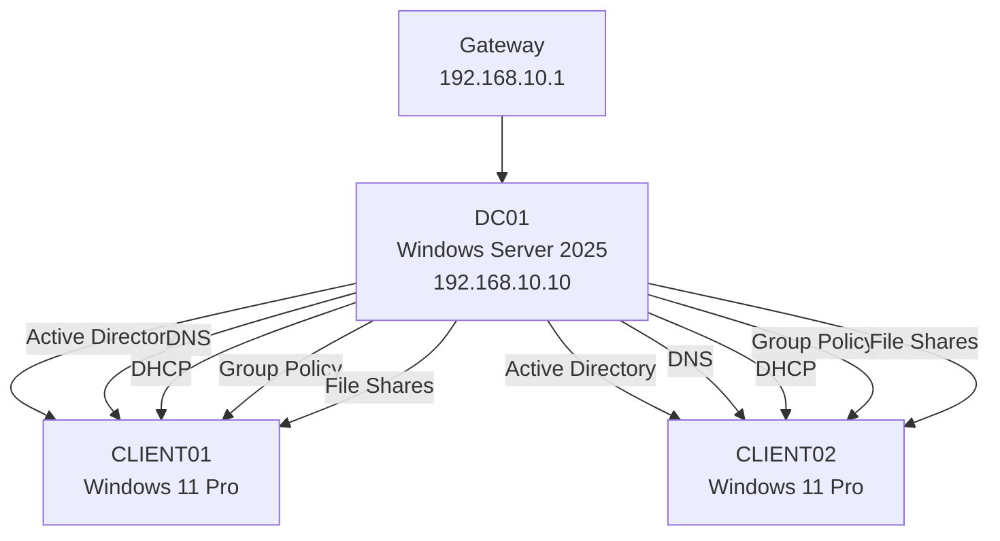

# 🏢 Enterprise Active Directory Lab

> A production-inspired Windows Server 2025 infrastructure built in Oracle VirtualBox.


---

## 📖 Overview

This repository documents the deployment of a Windows Server 2025 enterprise laboratory environment designed to simulate a small corporate network.

The primary objective of the project was to gain practical experience with enterprise Windows infrastructure by deploying and configuring a centralized Active Directory environment from scratch.

The lab includes a fully operational domain controller, automatic network configuration through DHCP, internal DNS name resolution, centralized authentication using Active Directory, Group Policy management, file sharing with NTFS permissions, and Windows 11 domain clients.

Although this environment was created as a learning project, every service was configured using practices commonly found in production environments.

---

## 📚 Table of Contents

* [🎯 Project Objectives](#-project-objectives)
* [🖥️ Lab Environment](#️-lab-environment)
* [🌐 Network Topology](#-network-topology)
* [📡 Network Configuration](#-network-configuration)
* [⚙️ Technologies](#️-technologies)
* [✨ Key Features](#-key-features)
* [📁 Repository Structure](#-repository-structure)
* [📌 Documentation](#-documentation)
* [🏛️ Infrastructure Design](#️-infrastructure-design)
* [🖧 Network Architecture](#-network-architecture)
* [🏢 Active Directory Structure](#-active-directory-structure)
* [👥 User and Group Management](#-user-and-group-management)
* [🔑 Authentication](#-authentication)
* [🚀 Project Highlights](#-project-highlights)
* [💼 Skills Demonstrated](#-skills-demonstrated)
* [📸 Screenshots](#-screenshots)

---

## 🎯 Project Objectives

The following objectives were successfully completed during the implementation of the lab:

* Deploy Windows Server 2025 as a Domain Controller
* Configure Active Directory Domain Services (AD DS)
* Deploy an integrated DNS Server
* Configure a DHCP Server with automatic address assignment
* Join Windows 11 clients to the domain
* Create Organizational Units (OU)
* Create users and security groups
* Configure shared folders
* Apply NTFS permissions
* Configure Group Policy Objects (GPO)
* Map network drives automatically
* Validate communication between all virtual machines

---

# 🖥️ Lab Environment

| Component               | Value               |
| ----------------------- | ------------------- |
| Hypervisor              | Oracle VirtualBox   |
| Server Operating System | Windows Server 2025 |
| Client Operating System | Windows 11 Pro      |
| Domain Name             | KUZNIETSOV.local    |
| Domain Controller       | DC01                |
| Virtual Network         | Internal Network    |
| Number of Servers       | 1                   |
| Number of Clients       | 2                   |

---

# 🌐 Network Topology

```text
                           VirtualBox Internal Network
                                      │
        ┌─────────────────────────────┼─────────────────────────────┐
        │                             │                             │
        │                             │                             │
      DC01                        CLIENT01                     CLIENT02
Windows Server 2025             Windows 11                  Windows 11
Domain Controller               Domain Joined               Domain Joined
DNS Server                      DHCP Client                 DHCP Client
DHCP Server
File Server
```

> **TODO:** Replace this diagram with `images/topology.png` after creating a visual network diagram.

---

# 📡 Network Configuration

| Device            | Address                         |
| ----------------- | ------------------------------- |
| Domain Controller | 192.168.10.10                   |
| DNS Server        | 192.168.10.10                   |
| DHCP Server       | 192.168.10.10                   |
| Gateway           | 192.168.10.1                    |
| DHCP Scope        | 192.168.10.100 – 192.168.10.200 |

---

# ⚙️ Technologies

| Technology                       | Purpose                          |
| -------------------------------- | -------------------------------- |
| Windows Server 2025              | Domain Services                  |
| Windows 11 Pro                   | Client Operating System          |
| Active Directory Domain Services | Centralized Authentication       |
| DNS                              | Name Resolution                  |
| DHCP                             | Automatic IP Configuration       |
| File Server                      | Centralized Storage              |
| NTFS Permissions                 | Access Control                   |
| Group Policy                     | Centralized Administration       |
| PowerShell                       | Administration & Troubleshooting |
| Oracle VirtualBox                | Virtualization Platform          |

---

# ✨ Key Features

* Centralized user authentication
* Enterprise DNS infrastructure
* Automatic IP address assignment
* Group Policy administration
* Shared network folders
* NTFS permission management
* Organizational Units
* Security Groups
* Automatic drive mapping
* Login script support
* Windows 11 domain integration

---

# 📁 Repository Structure

```text
windows-server-enterprise-lab/
│
├── README.md
├── LICENSE
├── .gitignore
│
├── docs/
│   ├── 01-network-topology.md
│   ├── 02-active-directory.md
│   ├── 03-dns.md
│   ├── 04-dhcp.md
│   ├── 05-file-server.md
│   ├── 06-group-policy.md
│   └── 07-testing.md
│
├── images/
│
└── scripts/
    └── login.bat
```

---

# 📌 Documentation

Detailed configuration guides are available in the `docs` directory.

| Document               | Description                         |
| ---------------------- | ----------------------------------- |
| 01-network-topology.md | Network design and IP addressing    |
| 02-active-directory.md | Active Directory deployment         |
| 03-dns.md              | DNS configuration                   |
| 04-dhcp.md             | DHCP configuration                  |
| 05-file-server.md      | Shared folders and NTFS permissions |
| 06-group-policy.md     | Group Policy configuration          |
| 07-testing.md          | Validation and testing procedures   |

---

> Continue reading to learn how each infrastructure service was configured and validated.

# 🏛️ Infrastructure Design

The laboratory environment simulates a centralized Windows Server infrastructure commonly found in small and medium-sized enterprises (SMEs). The deployment focuses on identity management, network services, centralized administration, and secure file sharing.

A single Windows Server 2025 virtual machine acts as the core infrastructure server and hosts multiple critical services. Two Windows 11 Pro virtual machines are joined to the Active Directory domain and function as managed client workstations.

The entire environment is isolated within an Oracle VirtualBox internal network, allowing enterprise technologies to be tested without requiring physical hardware or impacting the host operating system.

---

## Infrastructure Components

| Hostname | Operating System    | Role                                      |
| -------- | ------------------- | ----------------------------------------- |
| DC01     | Windows Server 2025 | Domain Controller, DNS, DHCP, File Server |
| CLIENT01 | Windows 11 Pro      | Domain Workstation                        |
| CLIENT02 | Windows 11 Pro      | Domain Workstation                        |

---

# 🖧 Network Architecture



The Domain Controller provides all core infrastructure services for the laboratory environment. Windows 11 clients automatically receive network configuration from the DHCP server, resolve names through the DNS service, authenticate against Active Directory, receive Group Policy Objects (GPOs), and access centralized file shares.


---

## IP Addressing

| Device            | Address                         |
| ----------------- | ------------------------------- |
| Domain Controller | 192.168.10.10                   |
| DNS Server        | 192.168.10.10                   |
| DHCP Server       | 192.168.10.10                   |
| Default Gateway   | 192.168.10.1                    |
| DHCP Scope        | 192.168.10.100 - 192.168.10.200 |

Clients automatically receive:

* IP Address
* Subnet Mask
* Default Gateway
* Preferred DNS Server
* Lease Time

using the DHCP service running on the Domain Controller.

---

# 🏢 Active Directory Structure

The Active Directory environment was organized using Organizational Units (OUs) to simplify administration and Group Policy deployment.

```text
Domain
│
└── Company
    │
    ├── Users
    │     ├── IT
    │     ├── HR
    │     └── Finance
    │
    ├── Groups
    │
    ├── Computers
    │
    └── Servers
```

This structure follows common enterprise administration practices by separating users, computers, and administrative objects into dedicated Organizational Units.

---

# 👥 User and Group Management

User accounts were created inside their respective Organizational Units and assigned to security groups according to their department.

Security groups are used to manage permissions instead of assigning permissions directly to users. This approach simplifies administration and follows Microsoft's recommended access control model.

Example departmental groups include:

| Group   | Purpose            |
| ------- | ------------------ |
| IT      | IT Department      |
| HR      | Human Resources    |
| Finance | Finance Department |

---

# 🔑 Authentication

Both Windows 11 clients were successfully joined to the Active Directory domain.

Domain authentication provides centralized identity management, allowing users to authenticate against the Domain Controller instead of maintaining separate local accounts on each workstation.

Benefits include:

* Centralized account management
* Single sign-on (SSO)
* Centralized password policies
* Group Policy enforcement
* Simplified administration

---

# 🚀 Project Highlights

This project demonstrates the deployment of a fully functional Microsoft enterprise infrastructure using Windows Server 2025 and Windows 11 clients.

Implemented features include:

* ✅ Deployed Windows Server 2025 as a Domain Controller
* ✅ Configured Active Directory Domain Services (AD DS)
* ✅ Implemented an Active Directory-integrated DNS Server
* ✅ Configured DHCP with automatic IPv4 address assignment
* ✅ Joined Windows 11 clients to the Active Directory domain
* ✅ Designed Organizational Units (OUs) for logical administration
* ✅ Created domain users and security groups
* ✅ Configured NTFS and Share Permissions
* ✅ Deployed a centralized File Server
* ✅ Configured Group Policy Objects (GPOs)
* ✅ Implemented automatic drive mapping
* ✅ Validated DNS, DHCP, authentication, and file sharing
* ✅ Verified Group Policy processing using `gpresult`
* ✅ Tested connectivity using `ping`, `nslookup`, and `ipconfig`

---

# 💼 Skills Demonstrated

This project demonstrates hands-on experience with Microsoft enterprise infrastructure technologies.

### Windows Server Administration

* Windows Server 2025
* Server Manager
* Feature and Role Installation
* Windows Server Management

### Active Directory

* Active Directory Domain Services (AD DS)
* Organizational Units (OU)
* Domain Users
* Security Groups
* Domain Join
* Authentication

### Networking

* DNS Server Configuration
* DHCP Server Configuration
* IPv4 Address Management
* Name Resolution
* Network Connectivity Testing

### Group Policy

* Group Policy Management Console (GPMC)
* Organizational Unit-based Policy Assignment
* Drive Mapping
* Login Scripts
* Security Policies

### File Services

* Shared Folders
* NTFS Permissions
* Share Permissions
* Access Control
* Centralized Storage

### Client Administration

* Windows 11 Domain Clients
* Domain Authentication
* Group Policy Processing
* Drive Mapping Validation

### Tools & Technologies

* Oracle VirtualBox
* PowerShell
* Command Prompt
* Event Viewer
* Windows Administrative Tools

---

# 📸 Screenshots

The following screenshots should be added to the repository:

* Active Directory Users and Computers
* Organizational Units
* User Accounts
* Security Groups
* Domain Join
* Computer Objects

Example:

```markdown


```

---

> The next section documents the deployment and validation of the DNS and DHCP infrastructure services.
