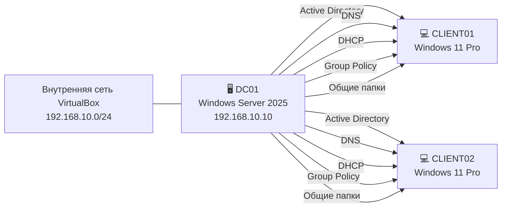

# 🌍 Языки

- 🇬🇧 [English](README.md)
- 🇷🇺 Русский (текущий)
- 🇺🇦 [Українська](README.uk.md)

# 🏢 Корпоративная лаборатория Active Directory

> Учебная лаборатория Microsoft Active Directory корпоративного уровня, построенная на базе Windows Server 2025 и клиентов Windows 11 в Oracle VirtualBox.


---

# 📖 Обзор

Этот репозиторий содержит документацию по развёртыванию лабораторной среды корпоративного уровня на базе Windows Server 2025, предназначенной для моделирования небольшой корпоративной сети.

Основной целью проекта было получение практического опыта работы с корпоративной инфраструктурой Windows посредством самостоятельного развёртывания и настройки централизованной среды Active Directory.

Лаборатория включает полностью функционирующий контроллер домена, автоматическую настройку сети с использованием DHCP, внутреннее разрешение DNS-имён, централизованную аутентификацию через Active Directory, управление групповыми политиками, файловый сервер с NTFS-разрешениями и клиентские компьютеры Windows 11, входящие в домен.

Несмотря на учебный характер проекта, конфигурация соответствует многим практикам, которые применяются в инфраструктуре небольших и средних предприятий.

---

## 🏗️ Обзор инфраструктуры

| Сервер | Службы |
|----------|-------------------------------------------------|
| DC01 | AD DS • DNS • DHCP • Файловый сервер • Group Policy |
| CLIENT01 | Рабочая станция домена |
| CLIENT02 | Рабочая станция домена |

---

# 📚 Содержание

* [🎯 Цели проекта](#-цели-проекта)
* [🖥️ Лабораторная среда](#️-лабораторная-среда)
* [🌐 Топология сети](#-топология-сети)
* [📡 Сетевая конфигурация](#-сетевая-конфигурация)
* [⚙️ Используемые технологии](#️-используемые-технологии)
* [✨ Основные возможности](#-основные-возможности)
* [📁 Структура репозитория](#-структура-репозитория)
* [📌 Документация](#-документация)
* [🏛️ Архитектура инфраструктуры](#️-архитектура-инфраструктуры)
* [🚀 Этапы развёртывания](#-этапы-развёртывания)
* [🖧 Архитектура сети](#-архитектура-сети)
* [🏢 Структура Active Directory](#-структура-active-directory)
* [👥 Управление пользователями и группами](#-управление-пользователями-и-группами)
* [🔑 Аутентификация](#-аутентификация)
* [🔐 Настройки безопасности](#-настройки-безопасности)
* [🚀 Основные результаты проекта](#-основные-результаты-проекта)
* [💼 Продемонстрированные навыки](#-продемонстрированные-навыки)
* [🚀 Дальнейшее развитие](#-дальнейшее-развитие)
* [📸 Скриншоты](#-скриншоты)
* [👤 Автор](#-автор)
* [📄 Лицензия](#-лицензия)

---

# 🎯 Цели проекта

В рамках реализации лаборатории были успешно выполнены следующие задачи:

- Развёртывание Windows Server 2025 в роли контроллера домена
- Настройка служб Active Directory Domain Services (AD DS)
- Развёртывание интегрированного DNS-сервера
- Настройка DHCP-сервера для автоматической выдачи IP-адресов
- Присоединение клиентов Windows 11 к домену
- Создание организационных подразделений (OU)
- Создание пользователей и групп безопасности
- Настройка общих папок
- Настройка разрешений NTFS
- Создание и применение объектов групповой политики (GPO)
- Автоматическое подключение сетевых дисков
- Проверка взаимодействия между всеми виртуальными машинами

---

# 🖥️ Лабораторная среда

| Компонент | Значение |
|-----------------------|-------------------|
| Гипервизор | Oracle VirtualBox |
| Серверная ОС | Windows Server 2025 |
| Клиентская ОС | Windows 11 Pro |
| Имя домена | KUZNIETSOV.local |
| Контроллер домена | DC01 |
| Виртуальная сеть | Internal Network |
| Количество серверов | 1 |
| Количество клиентов | 2 |

---

## Характеристики виртуальных машин

| Имя | CPU | RAM | Диск |
|---|---|---|---|
| DC01 | 2 vCPU | 4 GB | 60 GB |
| CLIENT01 | 2 vCPU | 4 GB | 50 GB |
| CLIENT02 | 2 vCPU | 4 GB | 50 GB |

---

# 🌐 Топология сети


Данная схема демонстрирует взаимодействие контроллера домена и клиентов Windows 11 внутри изолированной внутренней сети Oracle VirtualBox.

---

# 📡 Сетевая конфигурация

| Устройство | Адрес |
|-----------------|-------------------------------|
| Контроллер домена | 192.168.10.10 |
| DNS-сервер | 192.168.10.10 |
| DHCP-сервер | 192.168.10.10 |
| Шлюз | Не настроен |
| Диапазон DHCP | 192.168.10.100 – 192.168.10.200 |

---

# ⚙️ Используемые технологии

| Технология | Назначение |
|--------------------------------|--------------------------------|
| Windows Server 2025 | Службы домена |
| Windows 11 Pro | Клиентская операционная система |
| Active Directory Domain Services | Централизованная аутентификация |
| DNS | Разрешение имён |
| DHCP | Автоматическая настройка сети |
| File Server | Централизованное файловое хранилище |
| NTFS Permissions | Контроль доступа |
| Group Policy | Централизованное администрирование |
| PowerShell | Администрирование и диагностика |
| Oracle VirtualBox | Платформа виртуализации |

---

# ✨ Основные возможности

## Инфраструктура Active Directory

- Централизованные службы Active Directory Domain Services (AD DS)
- Организационные подразделения (OU) для пользователей, групп, компьютеров и серверов
- Управление доменными пользователями и группами безопасности
- Интеграция клиентов Windows 11 в домен
- Централизованная аутентификация

---

## Сетевые службы

- DNS-сервер, интегрированный с Active Directory
- DHCP-сервер с автоматической выдачей IPv4-адресов
- Автоматическая регистрация DNS-записей
- Внутреннее разрешение DNS-имён
- Централизованная сетевая конфигурация

---

## Файловые службы

- SMB-файловый сервер
- Общая папка (`\\DC01\Public`)
- Разрешения NTFS
- Разрешения общего доступа (Share Permissions)
- Автоматическое подключение сетевых дисков

---

## Объекты групповой политики (GPO)

- Развёртывание корпоративных обоев рабочего стола
- Скрытие локального диска C:
- Автоматическое подключение сетевых дисков
- Отключение командной строки (Command Prompt)
- Отключение панели управления
- Отключение редактора реестра
- Запрет использования USB-накопителей
- Настройка политики аудита Windows
- Развёртывание сценария входа в систему (Logon Script)

---

## Администрирование и проверка

- Group Policy Management Console (GPMC)
- Администрирование с помощью PowerShell
- Мониторинг через Event Viewer
- Проверка применения политик с помощью GPResult
- Тестирование сети с использованием Ping и NSLookup
- Проверка выданных DHCP-аренд
- Проверка доменной аутентификации

---

# 📁 Структура репозитория

```text
windows-server-enterprise-lab/
│
├── README.md
├── README.ru.md
├── README.uk.md
├── LICENSE
├── .gitignore
│
├── docs/
│   ├── en/
│   ├── ru/
│   └── uk/
│
├── images/
│   ├── active-directory/
│   ├── client/
│   ├── dhcp/
│   ├── dns/
│   ├── file-server/
│   ├── group-policy/
│   ├── infrastructure/
│   └── testing/
│
└── scripts/
    └── login.bat
```

---

# 📌 Документация

Подробные инструкции по настройке находятся в каталоге `docs`.

| Документ | Описание |
|----------------------|----------------------------------------|
| 01-network-topology.md | Проектирование сети и IP-адресация |
| 02-active-directory.md | Развёртывание Active Directory |
| 03-dns.md | Настройка DNS |
| 04-dhcp.md | Настройка DHCP |
| 05-file-server.md | Общие папки и разрешения NTFS |
| 06-group-policy.md | Настройка групповых политик |
| 07-testing.md | Проверка и тестирование инфраструктуры |

---

> Продолжайте чтение, чтобы узнать, как была настроена и протестирована каждая служба инфраструктуры.

---

# 🏛️ Архитектура инфраструктуры

Лабораторная среда моделирует централизованную инфраструктуру Windows Server, которая широко используется в небольших и средних предприятиях (SMB/SME). Основное внимание уделено управлению учётными записями, сетевым службам, централизованному администрированию и безопасному файловому обмену.

Одна виртуальная машина с Windows Server 2025 выполняет роль основного сервера инфраструктуры и предоставляет несколько критически важных служб одновременно.

Две виртуальные машины с Windows 11 Pro входят в домен Active Directory и используются в качестве управляемых рабочих станций.

Вся среда полностью изолирована внутри внутренней сети Oracle VirtualBox, что позволяет безопасно изучать корпоративные технологии Microsoft без использования физического оборудования и без влияния на основную операционную систему.

---

## Компоненты инфраструктуры

| Имя | Операционная система | Роль |
|---------|---------------------|--------------------------------------------|
| DC01 | Windows Server 2025 | Контроллер домена, DNS, DHCP, файловый сервер |
| CLIENT01 | Windows 11 Pro | Рабочая станция домена |
| CLIENT02 | Windows 11 Pro | Рабочая станция домена |

---

# 🚀 Этапы развёртывания

Лабораторная среда была развёрнута в следующем порядке:

1. Установка Windows Server 2025
2. Настройка статического IP-адреса
3. Установка роли Active Directory Domain Services (AD DS)
4. Повышение сервера до контроллера домена
5. Настройка службы DNS
6. Установка и настройка DHCP-сервера
7. Создание организационных подразделений (OU)
8. Создание пользователей и групп безопасности
9. Присоединение клиентов Windows 11 к домену
10. Настройка объектов групповой политики (GPO)
11. Настройка общего доступа к файлам и разрешений NTFS
12. Проверка аутентификации, DNS, DHCP и прав доступа

---

# 🖧 Архитектура сети



Контроллер домена предоставляет все основные инфраструктурные службы лабораторной среды. Клиенты Windows 11 автоматически получают сетевые параметры от DHCP-сервера, используют DNS для разрешения имён, проходят аутентификацию в Active Directory, получают объекты групповой политики (GPO) и получают доступ к централизованным файловым ресурсам.

---

## IP-адресация

| Устройство | Адрес |
|-----------------|-------------------------------|
| Контроллер домена | 192.168.10.10 |
| DNS-сервер | 192.168.10.10 |
| DHCP-сервер | 192.168.10.10 |
| Шлюз по умолчанию | Не настроен |
| Диапазон DHCP | 192.168.10.100 - 192.168.10.200 |

Клиенты автоматически получают:

- IP-адрес
- Маску подсети
- Предпочитаемый DNS-сервер
- Время аренды DHCP

с помощью DHCP-службы, работающей на контроллере домена.

---

# 🏢 Структура Active Directory

Среда Active Directory организована с использованием организационных подразделений (OU), что упрощает администрирование и применение групповых политик.

```text
Домен
│
└── Company
    │
    ├── Users
    │     ├── IT
    │     ├── HR
    │     └── Finance
    │
    ├── Groups
    │
    ├── Computers
    │
    └── Servers
```

Такая структура соответствует распространённым корпоративным практикам администрирования, разделяя пользователей, компьютеры и серверы на отдельные организационные подразделения.

---

# 👥 Управление пользователями и группами

Учётные записи пользователей были созданы в соответствующих организационных подразделениях и включены в группы безопасности согласно принадлежности к отделам.

Разрешения назначаются группам безопасности, а не отдельным пользователям. Такой подход значительно упрощает администрирование и соответствует рекомендуемой Microsoft модели управления доступом.

Пример групп безопасности:

| Группа | Назначение |
|--------|--------------------------|
| IT | ИТ-отдел |
| HR | Отдел кадров |
| Finance | Финансовый отдел |

---

# 🔑 Аутентификация

Оба клиента Windows 11 были успешно присоединены к домену Active Directory.

Доменная аутентификация обеспечивает централизованное управление учётными записями, позволяя пользователям входить в систему через контроллер домена вместо использования локальных учётных записей на каждом компьютере.

Преимущества:

- Централизованное управление учётными записями
- Единый вход (Single Sign-On, SSO)
- Централизованные политики паролей
- Применение групповых политик
- Упрощённое администрирование

---

# 🔐 Настройки безопасности

В лабораторной среде были реализованы следующие механизмы безопасности:

- Политики сложности и срока действия паролей
- Политики блокировки учётных записей
- Принцип минимально необходимых привилегий (Least Privilege)
- Контроль доступа NTFS
- Разрешения общего доступа (Share Permissions)

---

# 🚀 Основные результаты проекта

Данный проект демонстрирует развёртывание полностью функционирующей корпоративной инфраструктуры Microsoft на базе Windows Server 2025 и клиентов Windows 11.

Реализованные возможности:

- ✅ Развёрнут Windows Server 2025 в роли контроллера домена
- ✅ Настроены службы Active Directory Domain Services (AD DS)
- ✅ Развёрнут DNS-сервер, интегрированный с Active Directory
- ✅ Настроен DHCP с автоматической выдачей IPv4-адресов
- ✅ Клиенты Windows 11 успешно присоединены к домену Active Directory
- ✅ Создана структура организационных подразделений (OU)
- ✅ Созданы пользователи и группы безопасности
- ✅ Настроены разрешения NTFS и общего доступа
- ✅ Развёрнут централизованный файловый сервер
- ✅ Настроены объекты групповой политики (GPO)
- ✅ Реализовано автоматическое подключение сетевых дисков
- ✅ Проверены DNS, DHCP, аутентификация и файловый доступ
- ✅ Подтверждено применение групповых политик с помощью `gpresult`
- ✅ Выполнено тестирование сети с использованием `ping`, `nslookup` и `ipconfig`

---

# 💼 Продемонстрированные навыки

Данный проект демонстрирует практический опыт работы с корпоративной инфраструктурой Microsoft Windows.

## Администрирование Windows Server

- Windows Server 2025
- Server Manager
- Установка ролей и компонентов
- Администрирование Windows Server

---

## Active Directory

- Active Directory Domain Services (AD DS)
- Организационные подразделения (OU)
- Доменные пользователи
- Группы безопасности
- Присоединение компьютеров к домену
- Доменная аутентификация

---

## Сетевые технологии

- Настройка DNS-сервера
- Настройка DHCP-сервера
- Управление IPv4-адресацией
- Разрешение DNS-имён
- Тестирование сетевого подключения

---

## Group Policy

- Group Policy Management Console (GPMC)
- Назначение политик организационным подразделениям (OU)
- Автоматическое подключение сетевых дисков
- Сценарии входа в систему (Logon Scripts)
- Политики безопасности

---

## Файловые службы

- Общие папки
- Разрешения NTFS
- Разрешения общего доступа (Share Permissions)
- Контроль доступа
- Централизованное файловое хранилище

---

## Администрирование клиентских систем

- Клиенты Windows 11 в домене
- Доменная аутентификация
- Обработка групповых политик
- Проверка подключения сетевых дисков

---

## Инструменты и технологии

- Oracle VirtualBox
- PowerShell
- Command Prompt
- Event Viewer
- Средства администрирования Windows

---

# 🚀 Дальнейшее развитие

Планируемые улучшения проекта:

- Windows Admin Center
- Windows Server Backup
- WSUS
- DFS Namespace
- DFS Replication
- Active Directory Certificate Services (AD CS)
- Автоматизация с помощью PowerShell

---

# 📸 Скриншоты

Ниже представлены скриншоты, подтверждающие успешное развёртывание и тестирование лаборатории Enterprise Active Directory.

---

## Active Directory


Консоль **Active Directory Users and Computers**, отображающая структуру домена, организационные подразделения (OU) и объекты, созданные в ходе проекта.

---

## DNS Server


Консоль **DNS Manager** с зоной прямого просмотра, интегрированной с Active Directory, используемой для внутреннего разрешения DNS-имён.

---

## DHCP Server


Консоль **DHCP Manager**, отображающая настроенный диапазон IPv4-адресов, автоматически выдаваемых клиентским компьютерам.

---

## Organizational Units


Организационные подразделения (OU), созданные для логического разделения пользователей, компьютеров и административных объектов, что упрощает управление инфраструктурой и применение групповых политик.

---

## Group Policy Management


Объекты групповой политики (GPO), используемые для централизованного управления параметрами безопасности, конфигурацией рабочих столов и автоматическим подключением сетевых ресурсов.

---

## Shared Folder Configuration


Настройка общей папки на файловом сервере, предоставляющей централизованное хранилище для пользователей домена.

---

## NTFS Permissions


Настроенные разрешения NTFS, реализующие ролевую модель управления доступом на основе групп безопасности Active Directory.

---

## Share Permissions


Настройка разрешений общего доступа SMB, контролирующих сетевой доступ пользователей к общим ресурсам.

---

## Mapped Network Drive


Сетевой диск, автоматически подключаемый пользователям домена посредством групповой политики.

---

## Domain Join


Клиент Windows 11, успешно присоединённый к домену Active Directory и управляемый контроллером домена.

---

## Network Configuration


Клиент автоматически получил сетевые параметры от DHCP-сервера, включая IP-адрес и адрес DNS-сервера.

---

## DNS Resolution


Проверка разрешения DNS-имён с помощью команды `nslookup`, подтверждающая корректную работу внутреннего DNS-сервера.

---

## Group Policy Result


Результат выполнения команды `gpresult`, подтверждающий успешное применение всех ожидаемых объектов групповой политики (GPO).

---

## Event Viewer


Журнал событий Windows (Event Viewer), используемый для проверки успешной аутентификации пользователей и мониторинга работы инфраструктуры.

---

Эти скриншоты наглядно подтверждают успешное развёртывание инфраструктуры Active Directory, включая настройку DNS, DHCP, Group Policy, файловых служб и клиентов Windows 11, входящих в домен.

---

# 👤 Автор

## Портфолио-проект по администрированию Windows Server

Проект создан для демонстрации практических навыков развёртывания и администрирования корпоративной инфраструктуры Microsoft.

### Основные направления

- Active Directory
- Администрирование Windows Server
- DNS
- DHCP
- Group Policy
- Корпоративные сети

**Используемые технологии:** Windows Server 2025 • Active Directory • DNS • DHCP • Group Policy • Oracle VirtualBox

---

# 📄 Лицензия

Данный проект распространяется по лицензии **MIT**. Подробная информация приведена в файле **LICENSE**.