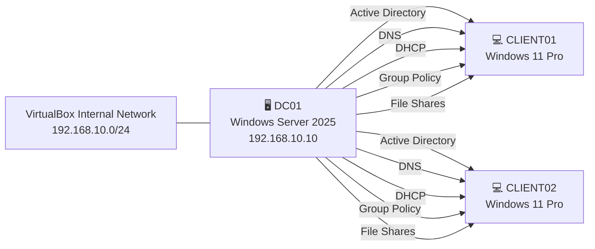

# 🌍 Мови

- 🇬🇧 [English](README.md)
- 🇷🇺 [Русский](README.ru.md)
- 🇺🇦 Українська (поточна)

# 🏢 Enterprise Active Directory Lab

> Лабораторне середовище Microsoft Active Directory корпоративного рівня, побудоване на базі Windows Server 2025 та клієнтів Windows 11 у Oracle VirtualBox.


---

# 📖 Огляд

Цей репозиторій містить документацію щодо розгортання лабораторного середовища Windows Server 2025 корпоративного рівня, створеного для моделювання невеликої корпоративної мережі.

Основною метою проєкту було отримання практичного досвіду з побудови корпоративної інфраструктури Windows шляхом розгортання та налаштування централізованого середовища Active Directory з нуля.

Лабораторія включає повноцінний контролер домену, автоматичну мережеву конфігурацію за допомогою DHCP, внутрішнє DNS-розпізнавання імен, централізовану автентифікацію через Active Directory, керування за допомогою Group Policy, файловий сервер із NTFS-дозволами та клієнти Windows 11, приєднані до домену.

Хоча це лабораторне середовище, конфігурація відповідає багатьом практикам, які широко використовуються у малих і середніх корпоративних мережах.

---

## 🏗️ Огляд інфраструктури

| Сервер | Служби |
|----------|-------------------------------------------------|
| DC01 | AD DS • DNS • DHCP • Файловий сервер • Group Policy |
| CLIENT01 | Робоча станція домену |
| CLIENT02 | Робоча станція домену |

---

## 📚 Зміст

* [🎯 Цілі проєкту](#-цілі-проєкту)
* [🖥️ Лабораторне середовище](#️-лабораторне-середовище)
* [🌐 Топологія мережі](#-топологія-мережі)
* [📡 Конфігурація мережі](#-конфігурація-мережі)
* [⚙️ Використані технології](#️-використані-технології)
* [✨ Основні можливості](#-основні-можливості)
* [📁 Структура репозиторію](#-структура-репозиторію)
* [📌 Документація](#-документація)
* [🏛️ Проєктування інфраструктури](#️-проєктування-інфраструктури)
* [🚀 Процес розгортання](#-процес-розгортання)
* [🖧 Архітектура мережі](#-архітектура-мережі)
* [🏢 Структура Active Directory](#-структура-active-directory)
* [👥 Керування користувачами та групами](#-керування-користувачами-та-групами)
* [🔑 Автентифікація](#-автентифікація)
* [🔐 Конфігурація безпеки](#-конфігурація-безпеки)
* [🚀 Основні результати проєкту](#-основні-результати-проєкту)
* [💼 Продемонстровані навички](#-продемонстровані-навички)
* [🚀 Подальший розвиток](#-подальший-розвиток)
* [📸 Знімки екрана](#-знімки-екрана)
* [👤 Автор](#-автор)
* [📄 Ліцензія](#-ліцензія)

---

## 🎯 Цілі проєкту

Під час реалізації лабораторії було успішно виконано такі завдання:

- Розгорнути Windows Server 2025 як контролер домену
- Налаштувати Active Directory Domain Services (AD DS)
- Розгорнути інтегрований DNS-сервер
- Налаштувати DHCP-сервер з автоматичною видачею IP-адрес
- Приєднати клієнти Windows 11 до домену
- Створити Organizational Units (OU)
- Створити користувачів і групи безпеки
- Налаштувати спільні папки
- Застосувати дозволи NTFS
- Налаштувати Group Policy Objects (GPO)
- Автоматично підключати мережеві диски
- Перевірити взаємодію між усіма віртуальними машинами

---

## 🖥️ Лабораторне середовище

| Компонент | Значення |
|-----------------------|-------------------|
| Гіпервізор | Oracle VirtualBox |
| Серверна ОС | Windows Server 2025 |
| Клієнтська ОС | Windows 11 Pro |
| Домен | KUZNIETSOV.local |
| Контролер домену | DC01 |
| Віртуальна мережа | Internal Network |
| Кількість серверів | 1 |
| Кількість клієнтів | 2 |

---

### Характеристики віртуальних машин

| Ім'я | CPU | RAM | Диск |
|---|---|---|---|
| DC01 | 2 vCPU | 4 ГБ | 60 ГБ |
| CLIENT01 | 2 vCPU | 4 ГБ | 50 ГБ |
| CLIENT02 | 2 vCPU | 4 ГБ | 50 ГБ |

---

## 🌐 Топологія мережі


Схема демонструє взаємодію між контролером домену та клієнтами Windows 11 у межах ізольованої внутрішньої мережі Oracle VirtualBox.

---

## 📡 Конфігурація мережі

| Пристрій | Адреса |
|-----------------|-------------------------------|
| Контролер домену | 192.168.10.10 |
| DNS-сервер | 192.168.10.10 |
| DHCP-сервер | 192.168.10.10 |
| Шлюз | Не налаштовано |
| DHCP-діапазон | 192.168.10.100 – 192.168.10.200 |

---

## ⚙️ Використані технології

| Технологія | Призначення |
| -------------------------------- | -------------------------------- |
| Windows Server 2025 | Служби домену |
| Windows 11 Pro | Клієнтська операційна система |
| Active Directory Domain Services | Централізована автентифікація |
| DNS | Розпізнавання імен |
| DHCP | Автоматична мережева конфігурація |
| File Server | Централізоване файлове сховище |
| NTFS Permissions | Керування доступом |
| Group Policy | Централізоване адміністрування |
| PowerShell | Адміністрування та діагностика |
| Oracle VirtualBox | Платформа віртуалізації |

---

## ✨ Основні можливості

### Інфраструктура Active Directory

- Централізовані служби Active Directory Domain Services (AD DS)
- Organizational Units (OU) для користувачів, груп, комп'ютерів і серверів
- Керування доменними користувачами та групами безпеки
- Інтеграція клієнтів Windows 11 з доменом
- Централізована автентифікація

---

### Мережеві служби

- DNS-сервер, інтегрований з Active Directory
- DHCP-сервер з автоматичною видачею IPv4-адрес
- Автоматична реєстрація DNS-записів
- Внутрішнє розпізнавання імен
- Централізована мережева конфігурація

---

### Файлові служби

- SMB File Server
- Спільна папка (`\\DC01\Public`)
- Дозволи NTFS
- Share Permissions
- Автоматичне підключення мережевих дисків

---

### Group Policy Objects (GPO)

- Автоматичне встановлення корпоративних шпалер
- Приховування локального диска C:
- Автоматичне підключення мережевих дисків
- Заборона використання Command Prompt
- Заборона доступу до Control Panel
- Заборона запуску Registry Editor
- Заборона використання USB-накопичувачів
- Політика аудиту Windows
- Розгортання Logon Script

---

### Адміністрування та перевірка

- Group Policy Management Console (GPMC)
- Адміністрування через PowerShell
- Моніторинг Event Viewer
- Перевірка за допомогою GPResult
- Тестування Ping та NSLookup
- Перевірка DHCP-оренди
- Тестування доменної автентифікації

---

## 📁 Структура репозиторію

```text
windows-server-enterprise-lab/
│
├── README.md
├── README.ru.md
├── README.uk.md
├── LICENSE
├── .gitignore
│
├── docs/
│   ├── en/
│   │   ├── 01-network-topology.md
│   │   ├── 02-active-directory.md
│   │   ├── 03-dns.md
│   │   ├── 04-dhcp.md
│   │   ├── 05-file-server.md
│   │   ├── 06-group-policy.md
│   │   └── 07-testing.md
│   │
│   ├── ru/
│   │   ├── 01-network-topology.md
│   │   ├── 02-active-directory.md
│   │   ├── 03-dns.md
│   │   ├── 04-dhcp.md
│   │   ├── 05-file-server.md
│   │   ├── 06-group-policy.md
│   │   └── 07-testing.md
│   │
│   └── uk/
│       ├── 01-network-topology.md
│       ├── 02-active-directory.md
│       ├── 03-dns.md
│       ├── 04-dhcp.md
│       ├── 05-file-server.md
│       ├── 06-group-policy.md
│       └── 07-testing.md
│
├── images/
│   ├── active-directory/
│   ├── client/
│   ├── dhcp/
│   ├── dns/
│   ├── file-server/
│   ├── group-policy/
│   ├── infrastructure/
│   └── testing/
│
└── scripts/
    └── login.bat
```

---

## 📌 Документація

Детальні інструкції з налаштування знаходяться в каталозі `docs`.

| Документ | Опис |
| ---------------------- | ----------------------------------- |
| 01-network-topology.md | Проєктування мережі та IP-адресація |
| 02-active-directory.md | Розгортання Active Directory |
| 03-dns.md | Налаштування DNS |
| 04-dhcp.md | Налаштування DHCP |
| 05-file-server.md | Спільні папки та дозволи NTFS |
| 06-group-policy.md | Налаштування Group Policy |
| 07-testing.md | Перевірка та тестування інфраструктури |

---

> Продовжуйте читати, щоб дізнатися, як було налаштовано та перевірено кожну службу інфраструктури.

---

## 🏛️ Проєктування інфраструктури

Лабораторне середовище моделює централізовану інфраструктуру Windows Server, яка широко використовується в малих і середніх підприємствах (SME). Основний акцент зроблено на керуванні обліковими записами, мережевих службах, централізованому адмініструванні та безпечному файловому доступі.

Єдина віртуальна машина Windows Server 2025 виконує роль центрального сервера інфраструктури та надає кілька критично важливих служб. Дві віртуальні машини Windows 11 Pro приєднані до домену Active Directory та використовуються як керовані робочі станції.

Усе середовище ізольоване всередині внутрішньої мережі Oracle VirtualBox, що дозволяє тестувати корпоративні технології без використання фізичного обладнання та без впливу на основну операційну систему.

---

### Компоненти інфраструктури

| Ім'я | Операційна система | Роль |
| -------- | ------------------- | ----------------------------------------- |
| DC01 | Windows Server 2025 | Контролер домену, DNS, DHCP, файловий сервер |
| CLIENT01 | Windows 11 Pro | Доменна робоча станція |
| CLIENT02 | Windows 11 Pro | Доменна робоча станція |

---

## 🚀 Процес розгортання

Лабораторне середовище було розгорнуто у такій послідовності:

1. Встановлення Windows Server 2025
2. Налаштування статичної IP-адреси
3. Встановлення ролі Active Directory Domain Services (AD DS)
4. Підвищення сервера до контролера домену
5. Налаштування служби DNS
6. Встановлення та налаштування DHCP-сервера
7. Створення Organizational Units (OU)
8. Створення користувачів і груп безпеки
9. Приєднання клієнтів Windows 11 до домену
10. Налаштування Group Policy Objects (GPO)
11. Налаштування файлового сервера та дозволів NTFS
12. Перевірка автентифікації, DNS, DHCP і прав доступу

---

## 🖧 Архітектура мережі



Контролер домену надає всі основні служби інфраструктури лабораторного середовища. Клієнти Windows 11 автоматично отримують мережеві параметри від DHCP-сервера, використовують DNS для розпізнавання імен, проходять автентифікацію через Active Directory, отримують політики Group Policy (GPO) та мають доступ до централізованих файлових ресурсів.

---

### IP-адресація

| Пристрій | Адреса |
| ----------------- | ------------------------------- |
| Контролер домену | 192.168.10.10 |
| DNS-сервер | 192.168.10.10 |
| DHCP-сервер | 192.168.10.10 |
| Шлюз за замовчуванням | Не налаштовано |
| DHCP-діапазон | 192.168.10.100 – 192.168.10.200 |

Клієнти автоматично отримують:

- IP-адресу
- Маску підмережі
- Основний DNS-сервер
- Час оренди

через службу DHCP, що працює на контролері домену.

---

## 🏢 Структура Active Directory

Середовище Active Directory було організоване за допомогою Organizational Units (OU), що значно спрощує адміністрування та застосування Group Policy.

```text
Domain
│
└── Company
    │
    ├── Users
    │     ├── IT
    │     ├── HR
    │     └── Finance
    │
    ├── Groups
    │
    ├── Computers
    │
    └── Servers
```

Така структура відповідає типовим корпоративним практикам, розділяючи користувачів, комп'ютери та адміністративні об'єкти на окремі Organizational Units.

---

## 👥 Керування користувачами та групами

Облікові записи користувачів були створені у відповідних Organizational Units і призначені до груп безпеки відповідно до їхніх підрозділів.

Для керування доступом використовуються групи безпеки замість безпосереднього призначення дозволів користувачам. Такий підхід значно спрощує адміністрування та відповідає рекомендованій Microsoft моделі керування доступом.

### Приклади груп безпеки

| Група | Призначення |
| ------- | ------------------ |
| IT | ІТ-відділ |
| HR | Відділ кадрів |
| Finance | Фінансовий відділ |

---

## 🔑 Автентифікація

Обидва клієнти Windows 11 були успішно приєднані до домену Active Directory.

Доменна автентифікація забезпечує централізоване керування обліковими записами, дозволяючи користувачам входити до системи через контролер домену, а не використовувати окремі локальні облікові записи на кожному комп'ютері.

### Переваги

- Централізоване керування обліковими записами
- Єдиний вхід (Single Sign-On, SSO)
- Централізовані політики паролів
- Автоматичне застосування Group Policy
- Спрощене адміністрування

---

## 🔐 Конфігурація безпеки

У лабораторному середовищі було реалізовано такі механізми безпеки:

- Політики паролів (Password Policies)
- Політики блокування облікових записів (Account Lockout Policies)
- Принцип найменших привілеїв (Least Privilege)
- Контроль доступу NTFS
- Права доступу до мережевих ресурсів (Share Permissions)

---

## 🚀 Основні результати проєкту

Цей проєкт демонструє розгортання повністю функціональної корпоративної інфраструктури Microsoft на базі Windows Server 2025 та клієнтів Windows 11.

### Реалізовано

- ✅ Розгорнуто Windows Server 2025 як контролер домену
- ✅ Налаштовано Active Directory Domain Services (AD DS)
- ✅ Розгорнуто DNS-сервер, інтегрований з Active Directory
- ✅ Налаштовано DHCP із автоматичною видачею IPv4-адрес
- ✅ Приєднано клієнти Windows 11 до домену Active Directory
- ✅ Створено Organizational Units (OU) для логічної організації об'єктів
- ✅ Створено доменних користувачів і групи безпеки
- ✅ Налаштовано дозволи NTFS та Share Permissions
- ✅ Розгорнуто централізований файловий сервер
- ✅ Налаштовано Group Policy Objects (GPO)
- ✅ Реалізовано автоматичне підключення мережевих дисків
- ✅ Перевірено роботу DNS, DHCP, автентифікації та файлового сервера
- ✅ Підтверджено застосування політик за допомогою `gpresult`
- ✅ Виконано тестування за допомогою `ping`, `nslookup` та `ipconfig`

---

## 💼 Продемонстровані навички

Цей проєкт демонструє практичний досвід роботи з корпоративною інфраструктурою Microsoft.

### Адміністрування Windows Server

- Windows Server 2025
- Server Manager
- Встановлення ролей і компонентів
- Адміністрування Windows Server

### Active Directory

- Active Directory Domain Services (AD DS)
- Organizational Units (OU)
- Доменні користувачі
- Групи безпеки
- Приєднання до домену
- Автентифікація

### Мережеві технології

- Налаштування DNS-сервера
- Налаштування DHCP-сервера
- Керування IPv4-адресами
- Розпізнавання імен
- Тестування мережевого з'єднання

### Group Policy

- Group Policy Management Console (GPMC)
- Призначення політик через Organizational Units
- Автоматичне підключення мережевих дисків
- Logon Scripts
- Політики безпеки

### Файлові служби

- Спільні папки
- Дозволи NTFS
- Share Permissions
- Контроль доступу
- Централізоване файлове сховище

### Адміністрування клієнтів

- Клієнти Windows 11 у домені
- Доменна автентифікація
- Обробка Group Policy
- Перевірка автоматичного підключення мережевих дисків

### Інструменти та технології

- Oracle VirtualBox
- PowerShell
- Command Prompt
- Event Viewer
- Засоби адміністрування Windows

---

## 🚀 Подальший розвиток

Заплановані покращення лабораторного середовища:

- Windows Admin Center
- Windows Server Backup
- Розгортання WSUS
- DFS Namespace
- DFS Replication
- Active Directory Certificate Services (AD CS)
- Автоматизація за допомогою PowerShell

---

## 📸 Скріншоти

Наведені нижче знімки екрана демонструють успішне розгортання та перевірку лабораторного середовища **Enterprise Active Directory Lab**.

### Active Directory


Консоль **Active Directory Users and Computers**, що відображає структуру домену, Organizational Units (OU) та об'єкти, створені під час виконання лабораторної роботи.

---

### DNS Server


Консоль **DNS Manager** з інтегрованою в Active Directory зоною прямого пошуку (Forward Lookup Zone), яка використовується для внутрішнього розпізнавання імен.

---

### DHCP Server


Консоль **DHCP Manager**, що демонструє налаштований IPv4-діапазон адрес, який автоматично видає мережеві параметри доменним клієнтам.

---

### Organizational Units


Створені **Organizational Units (OU)** для логічного розподілу користувачів, комп'ютерів та адміністративних об'єктів, що спрощує керування та застосування Group Policy.

---

### Group Policy Management


Налаштовані **Group Policy Objects (GPO)** для централізованого застосування параметрів безпеки, конфігурації робочого столу та автоматичного підключення мережевих дисків.

---

### Shared Folder Configuration


Конфігурація спільної папки на файловому сервері, що забезпечує централізоване сховище для автентифікованих користувачів домену.

---

### NTFS Permissions


Дозволи **NTFS**, налаштовані для реалізації рольової моделі контролю доступу за допомогою груп безпеки Active Directory.

---

### Share Permissions


Налаштовані **SMB Share Permissions**, які визначають мережевий доступ користувачів до спільних ресурсів.

---

### Mapped Network Drive


Мережевий диск, автоматично підключений користувачам домену за допомогою Group Policy.

---

### Domain Join


Клієнт Windows 11, успішно приєднаний до домену Active Directory та керований контролером домену.

---

### Network Configuration


Клієнт автоматично отримав IP-конфігурацію від DHCP-сервера, включаючи адресу DNS-сервера.

---

### DNS Resolution


Перевірка внутрішнього DNS за допомогою команди `nslookup`, яка підтверджує правильну роботу служби розпізнавання імен.

---

### Group Policy Result


Результат виконання команди `gpresult`, що підтверджує успішне застосування очікуваних Group Policy Objects (GPO).

---

### Event Viewer


**Windows Event Viewer**, використаний для перевірки подій автентифікації та моніторингу роботи системи під час тестування.

---

Наведені знімки екрана підтверджують успішне розгортання інфраструктури Active Directory та правильну роботу DNS, DHCP, Group Policy, файлового сервера й клієнтів Windows 11.

---

## 👤 Автор

### Портфоліо-проєкт з адміністрування Windows Server

Створений для демонстрації практичних навичок роботи з:

- Active Directory
- Адмініструванням Windows Server
- DNS
- DHCP
- Group Policy
- Корпоративними мережами

**Використані технології:** Windows Server 2025 • Active Directory • DNS • DHCP • Group Policy • Oracle VirtualBox

---

## 📄 Ліцензія

Цей проєкт поширюється за умовами ліцензії **MIT**.

Детальні умови наведено у файлі **LICENSE**.