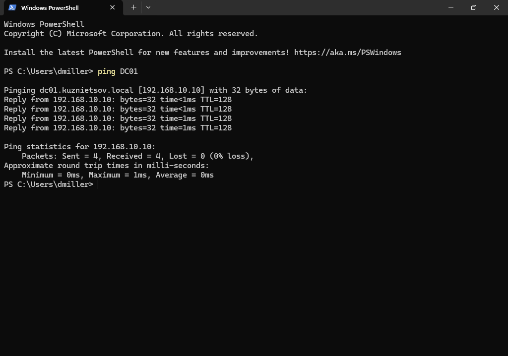

# ✅ Infrastructure Testing and Validation

## Overview

This document summarizes the validation process performed after deploying the Enterprise Active Directory Lab.

The purpose of testing was to verify that all configured services operate correctly and that Windows 11 client computers can successfully communicate with the Windows Server infrastructure.

---

# Test Environment

| Component         | Value               |
| ----------------- | ------------------- |
| Domain Controller | DC01                |
| Domain            | KUZNIETSOV.local    |
| Clients           | CLIENT01, CLIENT02  |
| Operating System  | Windows Server 2025 |
| Client OS         | Windows 11 Pro      |

---

# Validation Checklist

The following infrastructure components were successfully tested.

| Component             | Verification                  | Status |
| --------------------- | ----------------------------- | :----: |
| Active Directory      | Domain operational            |    ✅   |
| DNS                   | Hostname resolution           |    ✅   |
| DHCP                  | Automatic IP assignment       |    ✅   |
| File Server           | Shared folder access          |    ✅   |
| Group Policy          | Policies applied successfully |    ✅   |
| Login Script          | Executed during user logon    |    ✅   |
| Network Drive Mapping | Connected automatically       |    ✅   |
| Domain Authentication | Successful                    |    ✅   |
| Client Connectivity   | Successful                    |    ✅   |

---

# Network Connectivity

Connectivity between the Domain Controller and both client workstations was verified using ICMP (ping).

Command:

```cmd id="ixtq5r"
ping DC01
```

Expected Result:

* Successful replies
* No packet loss
* Stable communication between clients and server

---

# DNS Validation

DNS functionality was verified using the following command.

```cmd id="wnkj8m"
nslookup DC01
```

The Domain Controller hostname resolved successfully, confirming that the Active Directory-integrated DNS server was functioning correctly.

---

# DHCP Validation

Client computers automatically received network configuration from the DHCP server.

Verified information included:

* IPv4 Address
* Subnet Mask
* Default Gateway
* Preferred DNS Server
* DNS Suffix

Command:

```cmd id="skgrja"
ipconfig /all
```

---

# Group Policy Validation

Group Policy deployment was verified after signing in with a domain account.

Command:

```cmd id="ixz2zz"
gpresult /r
```

The output confirmed that the configured Group Policy Objects had been successfully applied.

---

# File Server Validation

The shared folder was successfully accessed using the mapped network drive.

Verified functionality:

* Automatic drive mapping
* Read access
* Write access (where permitted)
* Network connectivity to the shared folder

Example network path:

```text id="prdzf7"
\\DC01\Public
```

---

# Active Directory Validation

The following items were successfully verified:

* Domain users authenticated successfully
* Windows 11 clients joined the domain
* Computer accounts appeared in Active Directory
* Organizational Units functioned correctly
* Security groups were available for permission assignment

---

# Test Results

| Test                    |  Result  |
| ----------------------- | :------: |
| Domain Join             | ✅ Passed |
| DNS Resolution          | ✅ Passed |
| DHCP Lease              | ✅ Passed |
| Ping Test               | ✅ Passed |
| Shared Folder Access    | ✅ Passed |
| Network Drive Mapping   | ✅ Passed |
| Group Policy Processing | ✅ Passed |
| Login Script            | ✅ Passed |
| User Authentication     | ✅ Passed |

---

# Screenshots

## IP Configuration


---

## Ping Test



---

## DNS Resolution


---

## Group Policy Result


---

## Event Viewer


---

# Conclusion

The Enterprise Active Directory Lab was successfully deployed and validated.

All core infrastructure services—including Active Directory Domain Services, DNS, DHCP, File Services, and Group Policy—operated as expected throughout testing.

The environment demonstrates practical experience with Windows Server administration, centralized identity management, network services, Group Policy deployment, and enterprise file sharing.

This project closely reflects the configuration and validation processes commonly performed in small and medium-sized Windows enterprise environments.
